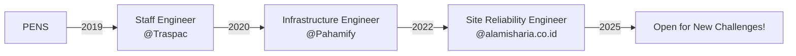

# Hi there, I'm Ainun! 👋

  

## 🚀 About Me

Seasoned **Site Reliability Engineer** with 5+ years of expertise in designing, scaling, and optimizing cloud-native infrastructure for **fintech and edtech platforms**. Currently based in Gresik, Indonesia 🇮🇩, with proven experience in cost optimization, implementing enterprise-grade observability systems, and maintaining high-availability platforms.

- 🏆 **CKA Certified** (Valid through November 2026)
- ☁️ **Multi-cloud Expert** in Kubernetes, Infrastructure as Code, and monitoring at scale across GCP, AWS, and hybrid environments
- 💰 Achieved **50%+ cost reductions** through strategic cloud optimizations
- 🔧 Specialized in **enterprise-grade observability** and high-availability platform design
- 🏠 Running a **production-grade homelab** with Proxmox, Kubernetes, and 20+ self-hosted services
- ☸️ Building **open-source Kubernetes manifests** for the homelab community

## 💼 Professional Journey

## 🛠️ Tech Stack

### Cloud & Infrastructure

### IaC & Automation

### Monitoring & Observability

### Languages

## 🏗️ Featured Projects

<table>
  <tr>
    <td align="center" width="50%">
      <h3>☸️ Kubernetes Services</h3>
      
Production-ready Kubernetes configurations for self-hosted services in homelab environments

      
    </td>
    <td align="center" width="50%">
      <h3>🔗 More Projects</h3>
      
Explore additional repositories showcasing Infrastructure as Code, automation, and cloud-native solutions

      
    </td>
  </tr>
</table>

## 🌟 Open Source Contributions

### 📦 homelab-k8s-services
> **Production-Ready Kubernetes Manifests for Homelab**

My flagship open-source project providing battle-tested Kubernetes configurations for popular self-hosted applications. This complements my broader homelab infrastructure that includes Terraform-managed Proxmox clusters and Ansible-automated Docker services:

**🔧 Platform Services:**
- cert-manager (Let's Encrypt automation)
- ingress-nginx (SSL termination & routing)
- MetalLB (Load balancing for bare metal)
- Prometheus + Grafana (Monitoring stack)

**🚀 Applications:**
- **Productivity**: Gitea, Vaultwarden, Vikunja, Wiki.js
- **Media**: Immich, Calibre, FileBrowser
- **AI Tools**: Open WebUI, LiteLLM, ChatPad
- **Utilities**: Excalidraw, Linkding, Memos

**📊 Project Features:**
- 🏗️ **Architecture**: Kustomize overlays + Helm charts
- 🔒 **Security**: RBAC, Network Policies, non-root containers  
- 📖 **Documentation**: Comprehensive setup and troubleshooting guides
- 🧪 **Battle-tested**: Running reliably in production homelab environment
- 🎯 **Focus**: Production-ready configurations for homelab enthusiasts

## 📊 GitHub Stats

  
  

## 🎯 Current Focus

- 🔨 Building **homelab-k8s-services** - comprehensive Kubernetes manifests for self-hosted applications
- 📚 Writing technical blogs about **SRE practices** and **homelab adventures**
- 🌱 Exploring **GitOps** patterns with ArgoCD and Flux
- 🤖 Integrating **AI/ML workloads** into homelab infrastructure
- 🤝 Open to **freelance opportunities** and **consulting engagements**

## 📝 Latest Blog Posts
<!-- BLOG-POST-LIST:START -->
- [My 4-Month Journey: From Google One to Self-Hosted Photo Storage](https://abdullahainun.site/posts/homelab/google-one-to-homelab-journey/)
- [Notes on Self-Hosting Linkding: My Personal Bookmark Manager Journey](https://abdullahainun.site/posts/homelab/linkding-self-hosted-bookmark-manager/)
- [Notes on Setting Up Local SSL with Caddy and Cloudflare in My Homelab](https://abdullahainun.site/posts/homelab/caddy-cloudflare-homelab-ssl-local-domain/)
<!-- BLOG-POST-LIST:END -->

## 🏆 Certifications & Achievements

- 🎖️ **Certified Kubernetes Administrator (CKA)** - Valid through November 2026
- 💰 **Cost Optimization Expert** - Reduced cloud costs by 50%+ across multiple organizations  
- 🔧 **Infrastructure Automation** - Transformed manual processes to IaC
- 🚀 **Open Source Contributor** - Building production-ready Kubernetes resources for the community

## 🤝 Let's Connect!

  

---

  
  
  
💡 <i>"Infrastructure as Code isn't just about automation—it's about building reliable, scalable systems that empower teams to focus on what matters most."</i>

