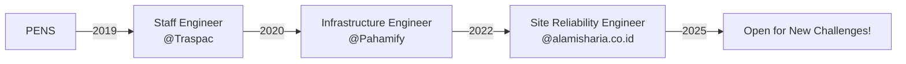

# Hi there, I'm Ainun! 👋

  

## 🚀 About Me

I'm a **Site Reliability Engineer** with 5+ years of experience building resilient, scalable infrastructure. Currently based in Gresik, Indonesia 🇮🇩, working remotely to help companies optimize their cloud infrastructure and reduce operational costs.

- 🏆 **CKA Certified** (Valid through November 2026)
- 💰 Saved companies **50%+ on cloud costs** through strategic optimizations
- 🔧 Transformed infrastructure from **chaos to code** using Terraform & Ansible
- 🏠 Running a **production-grade homelab** with Proxmox, Kubernetes, and 20+ self-hosted services

## 💼 Professional Journey

## 🛠️ Tech Stack

### Cloud & Infrastructure

### IaC & Automation

### Monitoring & Observability

### Languages

## 🏗️ Featured Projects

<table>
  <tr>
    <td align="center" width="50%">
      <h3>🏠 Homelab Infrastructure</h3>
      
Production-grade homelab running on 4 mini PCs with Proxmox clustering, automated with Terraform

      
    </td>
    <td align="center" width="50%">
      <h3>☸️ Kubernetes GitOps</h3>
      
Complete Kubernetes deployment using GitOps principles with ArgoCD and Flux

      
    </td>
  </tr>
</table>

## 📊 GitHub Stats

  
  

## 🎯 Current Focus

- 🔨 Building a comprehensive **Infrastructure as Code** template library
- 📚 Writing technical blogs about **SRE practices** and **homelab adventures**
- 🌱 Exploring **GitOps**
- 🤝 Open to **freelance opportunities** and **consulting engagements**

## 📝 Latest Blog Posts
<!-- BLOG-POST-LIST:START -->
- [My 4-Month Journey: From Google One to Self-Hosted Photo Storage](https://abdullahainun.site/posts/homelab/google-one-to-homelab-journey/)
- [Notes on Self-Hosting Linkding: My Personal Bookmark Manager Journey
](https://abdullahainun.site/posts/homelab/linkding-self-hosted-bookmark-manager/)
- [Notes on Setting Up Local SSL with Caddy and Cloudflare in My Homelab
](https://abdullahainun.site/posts/homelab/caddy-cloudflare-homelab-ssl-local-domain/)
<!-- BLOG-POST-LIST:END -->

## 🤝 Let's Connect!

  

---

  
  
  
💡 <i>"The best way to learn is to build, break, and rebuild."</i>

